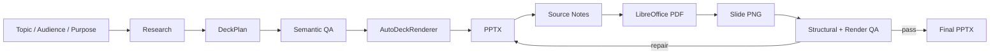

# Canva-style PowerPoint MCP 3.4

Python 기반의 **하이브리드 PowerPoint 자동화 MCP**입니다.

이 프로젝트는 PowerPoint 작업을 두 엔진으로 분리합니다.

- **새 프레젠테이션 생성**: `python-pptx` 기반 자동 디자인/콘텐츠 생성 엔진
- **기존 템플릿 내용 수정**: Windows Microsoft PowerPoint **COM (`pywin32`)** 기반 템플릿 보존 편집 엔진

두 모드는 같은 코드 경로를 공유하지 않습니다. 새 PPT는 디자인까지 새로 만들고, 템플릿 모드는 기존 PowerPoint의 디자인 구조를 보존한 채 **텍스트 내용만 수정**하는 것을 목표로 합니다.

현재 버전의 핵심 원칙은 다음과 같습니다.

1. **모드 확인을 반드시 먼저 수행**한다.
2. 새 PPT 생성은 `python-pptx`만 사용한다.
3. 기존 템플릿 수정은 PowerPoint COM만 사용한다.
4. COM 수정은 **PowerPoint 창을 실제로 보여주면서** 진행한다.
5. COM 수정 중 개별 오류가 발생해도 가능한 작업을 먼저 끝까지 수행한다.
6. 전체 편집이 끝난 뒤 QA를 수행하고 문제가 있는 부분만 제한적으로 재수정한다.
7. 같은 오류가 반복되면 cycle breaker가 재시도를 중단한다.
8. IBM Bob 같은 MCP 클라이언트가 동일 작업을 무한 재호출하지 않도록 COM 운영 오류를 가능한 한 **정상 JSON 결과**로 반환한다.

---

## 목차

- [1. 전체 아키텍처](#1-전체-아키텍처)
- [2. 두 가지 실행 모드](#2-두-가지-실행-모드)
- [3. Mode Gate](#3-mode-gate)
- [4. Generate 모드](#4-generate-모드-python-pptx)
- [5. Template COM 모드](#5-template-com-모드-powerpoint-com)
- [6. QA 아키텍처](#6-qa-아키텍처)
- [7. 프로젝트 모듈 구조](#7-프로젝트-모듈-구조)
- [8. 핵심 데이터 모델](#8-핵심-데이터-모델)
- [9. MCP 도구](#9-mcp-도구)
- [10. CLI](#10-cli)
- [11. 설치](#11-설치)
- [12. 환경 변수](#12-환경-변수)
- [13. MCP 연결](#13-mcp-연결)
- [14. PowerPoint Routing Skill](#14-powerpoint-routing-skill)
- [15. 출력 파일과 QA 로그](#15-출력-파일과-qa-로그)
- [16. 보안 및 안전장치](#16-보안-및-안전장치)
- [17. 오류 처리와 Bob 대응](#17-오류-처리와-bob-대응)
- [18. 테스트](#18-테스트)
- [19. 제한사항](#19-제한사항)
- [20. 버전 변화 요약](#20-버전-변화-요약)

---

# 1. 전체 아키텍처

```mermaid
flowchart TD
    U[User / MCP Client / IBM Bob] --> G[Mode Gate]
    G --> P[prepare_presentation_task]
    P --> C{사용자가 모드 선택}
    C -->|generate| CG[confirm_presentation_mode]
    C -->|template_com| CT[confirm_presentation_mode]
    CG --> TG[1회용 generate execution_token]
    CT --> TT[1회용 template_com execution_token]

    TG --> GEN[Generate Engine]
    GEN --> R[Research]
    R --> PL[DeckPlan Planner]
    PL --> SQ[Semantic QA]
    SQ --> PR[python-pptx Renderer]
    PR --> RN[Speaker Notes / Sources]
    RN --> RQ[Render QA + Auto Repair]
    RQ --> GPPT[새 PPTX]

    TT --> COM[Template COM Engine]
    COM --> TR[/template 템플릿 선택]
    TR --> CP[원본을 output으로 복사]
    CP --> PLAN[템플릿 슬라이드 수에 맞춰 DeckPlan 생성]
    PLAN --> WP[Visible PowerPoint COM First Pass]
    WP --> SAVE[전체 저장]
    SAVE --> PQA[Deferred Post-QA]
    PQA --> FIX[문제 Shape만 Bounded Repair]
    FIX --> DA[Design Fingerprint Audit]
    DA --> MPPT[수정 PPTX + Manifest]
```

## 핵심 설계

프로젝트는 크게 6개 층으로 볼 수 있습니다.

| 계층 | 역할 | 주요 모듈 |
|---|---|---|
| Routing | 사용자 의도 추천, 강제 모드 확인, 실행 토큰 | `routing.py`, `server.py` |
| Research / Planning | 자료 수집, 근거 추출, DeckPlan 생성 | `research.py`, `planner.py`, `prompts.py` |
| Generate Rendering | 새 PPT 디자인 및 렌더링 | `render.py` |
| COM Editing | 기존 템플릿의 visible text 수정 | `com_editor.py` |
| QA | 의미/근거/레이아웃/렌더링/디자인 보존 검증 | `semantic_qa.py`, `qa.py`, `com_editor.py` |
| Interface | MCP/CLI/Skill 진입점 | `server.py`, `cli.py`, `skills/` |

---

# 2. 두 가지 실행 모드

| 항목 | `generate` | `template_com` |
|---|---|---|
| 목적 | 처음부터 새 PPT 생성 | 기존 템플릿 내용만 변경 |
| 엔진 | `python-pptx` | Microsoft PowerPoint COM |
| 디자인 | 시스템이 새로 설계 | 원본 디자인 보존 |
| 운영체제 | Windows / macOS / Linux 가능 | **Windows 전용** |
| PowerPoint 설치 | 불필요 | **필수** |
| `pywin32` | 불필요 | **필수** |
| LibreOffice | Render QA에 필요 | generate QA/별도 QA 도구에 필요 |
| 수정 화면 표시 | 해당 없음 | **항상 표시** |
| 템플릿 경로 | 사용 금지 | `/template` 폴더만 허용 |
| 중간 오류 정책 | QA 실패 시 실패 | Complete-first / Validate-after |
| 전체 자동 재시작 | generate 호출자 정책에 따름 | **금지** |

### 예시

```text
"IBM 소개 PPT 만들어줘"
→ generate 추천
→ 사용자 확인
→ python-pptx로 새 PPT 생성
```

```text
"company_qbr 템플릿의 디자인은 그대로 두고 내용만 IBM에 맞게 바꿔줘"
→ template_com 추천
→ 사용자 확인
→ PowerPoint COM으로 텍스트만 수정
```

> 의도 추천이 명확하더라도 **사용자 확인은 생략하지 않습니다.**

---

# 3. Mode Gate

PowerPoint 파일을 변경하는 MCP 도구는 실행 전에 Mode Gate를 통과해야 합니다.

## MCP 실행 순서

```text
1. prepare_presentation_task(user_request)
        ↓
2. 사용자에게 두 모드 중 하나를 질문
        ↓
3. 사용자가 직접 선택
        ↓
4. confirm_presentation_mode(confirmation_id, selected_mode)
        ↓
5. 1회용 execution_token 발급
        ↓
6. create_presentation 또는 edit_template_presentation 실행
```

### Mode Gate가 필요한 이유

사용자의 문장만 보고 자동으로 모드를 확정하면 다음 문제가 생길 수 있습니다.

- 새로 만들려던 요청이 기존 템플릿을 덮어쓸 수 있음
- 기존 디자인 유지 요청을 python-pptx로 다시 구성할 수 있음
- AI가 잘못 추론한 모드로 파일 작업을 시작할 수 있음

따라서 `infer_presentation_mode()`는 **추천만 수행**하고 사용자 동의로 간주하지 않습니다.

## 실행 토큰

`confirm_presentation_mode()`는 선택된 모드에 맞는 **1회용 token**을 발급합니다.

- TTL: 30분 (`1800초`)
- 한 번 사용하면 폐기
- `generate` token으로 COM 편집 불가
- `template_com` token으로 새 PPT 생성 불가

MCP에서는 이 token이 없으면 파일 변경 도구가 실행되지 않습니다.

> CLI는 MCP token을 사용하지 않고, 실행 직전에 직접 모드 확인 프롬프트를 표시합니다. 자동화에서 사용자가 이미 모드를 확정했다면 `--yes-mode-confirmed`를 사용할 수 있습니다.

---

# 4. Generate 모드 (`python-pptx`)

새 PowerPoint를 처음부터 생성하는 파이프라인입니다.



## 4.1 Research

`research.py`가 콘텐츠의 근거 자료를 준비합니다.

지원 입력:

1. `research_documents`
   - 여러 개의 `{title, url, text}` 문서
2. `research_text`
   - 사용자가 직접 제공한 텍스트
3. 입력 자료가 없으면 Wikipedia 공개 API

현재 자동 공개 조사 기본 소스는 Wikipedia입니다.

```json
[
  {
    "title": "공식 문서",
    "url": "https://example.com/official",
    "text": "..."
  },
  {
    "title": "운영 보고서",
    "url": "https://example.com/report",
    "text": "..."
  }
]
```

`research_required=true` 상태에서 필요한 자료를 확보하지 못하면 범용 문구로 억지 생성하지 않고 실패합니다.

## 4.2 Planner / DeckPlan

`planner.py`가 조사 결과를 `DeckPlan`으로 변환합니다.

OpenAI API 키가 있으면 JSON Schema 기반 LLM 계획을 사용하며, 키가 없으면 조사 문장을 기반으로 오프라인/규칙 기반 계획을 만듭니다.

```text
Research
  ↓
EvidenceClaim(c001, c002, ...)
  ↓
SlideSpec / ContentItem
  ↓
claim_ids 연결
  ↓
Speaker Notes [Sources]
```

### 콘텐츠 Grounding

각 외부 주장에는 `claim_id`가 연결됩니다.

예:

```text
ContentItem.claim_ids = ["c003"]
EvidenceClaim.c003.source_url = "..."
```

숫자가 있는 본문은 연결된 원문에도 같은 숫자가 있는지 검증합니다.

## 4.3 디자인 시스템

`DesignSystem`이 덱 전체 디자인 규칙을 정의합니다.

지원 스타일 프리셋:

- `orbital`
- `editorial`
- `neon`
- `organic`
- `luxury`
- `geometric`
- `swiss`

사용자가 `style_preference`를 지정하지 않으면 주제·대상·목적을 기반으로 결정적으로 스타일을 선택합니다.

### 지원 레이아웃

- `title`
- `two_column`
- `icon_rows`
- `big_stat`
- `grid_2x2`
- `timeline`
- `comparison`
- `image_focus`
- `chart`
- `closing`

### 주요 디자인 규칙

- 제목: 기본 44~60pt 범위
- 본문: 14pt 이상
- 큰 통계 숫자: 약 80~120pt 수준
- 다크 슬라이드 비율: 40~50%
- 동일 레이아웃 연속 반복 방지
- 비대칭 구성 / 대형 시각 앵커 / 레이어 / 컬러 블로킹
- 강조 슬라이드에 래스터 그라데이션 및 미묘한 노이즈 텍스처
- 표지와 마무리의 장식 구도 반복 방지

## 4.4 Renderer

`render.py`의 `AutoDeckRenderer`가 `DeckPlan`을 실제 PowerPoint로 변환합니다.

지원 요소:

- 텍스트 박스
- 카드 / 원형 모티프 / 장식 Shape
- 래스터 그라데이션 배경
- 로컬 이미지
- 공개 HTTP(S) 이미지
- Full-bleed 이미지 크롭
- 네이티브 PowerPoint 차트
  - bar
  - column
  - line
  - pie
- Speaker Notes

### 이미지 안전장치

외부 이미지 URL은 다음 검사를 수행합니다.

- HTTP/HTTPS만 허용
- 사설 IP / loopback / link-local 차단
- 다운로드 용량 제한
- 실제 이미지 파일 검증

## 4.5 Generate Semantic QA

`semantic_qa.py`는 렌더링 전 내용 자체를 검사합니다.

주요 검사 코드:

| 코드 | 의미 |
|---|---|
| `UNGROUNDED_CONTENT` | 조사 근거 없이 생성 |
| `GENERIC_FILLER` | 범용 filler 문구 사용 |
| `TOPIC_NOT_PRESENT` | 주제가 실제 내용에 없음 |
| `SOURCE_NOTES_MISSING` | source notes 없음 |
| `CLAIM_SOURCE_MISSING` | claim 연결 없음 |
| `UNKNOWN_CLAIM_ID` | 존재하지 않는 claim 참조 |
| `UNSUPPORTED_CLAIM` | 본문과 근거의 의미/수치 불일치 |
| `SLIDE_TITLE_WRAP_RISK` | 제목 한 줄 초과 위험 |
| `ITEM_HEADING_TOO_LONG` | 항목 제목이 너무 김 |
| `EXTRACTIVE_SLIDE_TITLE` | 본문 일부를 잘라 제목으로 사용 |
| `UNLOCALIZED_LABEL` | 한국어 덱에 고정 영문 UI가 남음 |
| `SINGLE_SOURCE` | 단일 출처 기반 경고 |

Semantic QA의 error가 있으면 generate 모드는 렌더링 전에 중단됩니다.

## 4.6 Render QA

`qa.py`는 생성된 PPTX를 LibreOffice로 PDF 변환한 뒤 PNG까지 렌더링하여 구조와 실제 렌더 결과를 검사합니다.

주요 검사:

- `OUT_OF_BOUNDS`
- `TEXT_OVERFLOW`
- `TITLE_WRAP`
- `TEXT_OVERLAP`
- `VISUAL_OVER_TEXT`
- `LOW_CONTRAST`
- `DECOR_TEXT_CONTRAST`
- `EMPTY_PLACEHOLDER`
- `PLACEHOLDER`
- `NO_VISUAL`
- `RENDER_TEXT_LOSS`
- `DARK_RHYTHM`

수정 가능한 오류는 제한적으로 자동 수정한 뒤 해당 슬라이드를 다시 렌더링합니다.

`max_qa_rounds` 내에 error가 남으면 generate 작업은 성공으로 보고하지 않습니다.

---

# 5. Template COM 모드 (PowerPoint COM)

기존 PPT의 디자인 구조를 유지하면서 내용을 바꾸는 모드입니다.

> 이 모드는 **Windows + Microsoft PowerPoint + pywin32**가 필요합니다.

## 5.1 지원 템플릿

`/template` 폴더에서 다음 형식을 탐색합니다.

- `.pptx`
- `.pptm`
- `.potx`
- `.potm`

원본 템플릿은 절대 직접 덮어쓰지 않습니다.

```text
/template/company_qbr.pptx
        ↓ copy / SaveAs
/output/ibm-qbr.pptx
        ↓
COM은 output 파일만 수정
```

COM output은 `.pptx` 또는 `.pptm`이어야 합니다.

## 5.2 템플릿 선택 보안

`resolve_template()`은 임의의 외부 파일 경로를 허용하지 않습니다.

```text
허용: project/template/company_qbr.pptx
거부: C:/random/file.pptx
거부: ../../other/file.pptx
```

`template_dir`을 명시하면 해당 디렉터리를 템플릿 루트로 사용할 수 있습니다.

## 5.3 콘텐츠 계획

COM 모드도 콘텐츠 자체는 generate와 같은 `create_plan()`을 사용합니다.

차이는 슬라이드 수입니다.

```text
기존 템플릿 slide_count
        ↓
동일한 수의 SlideSpec 생성
        ↓
각 기존 슬라이드의 Text Slot에 매핑
```

즉 COM 모드는 새 슬라이드 레이아웃을 만들지 않고, **템플릿에 이미 존재하는 슬라이드 수를 그대로 유지**합니다.

## 5.4 Editable Text Slot 탐색

`com_editor.py`가 각 슬라이드의 텍스트 Shape를 탐색합니다.

보호 대상은 수정하지 않습니다.

- Date
- Header/Footer
- Slide Number
- Shape 이름에 `footer`, `slide number`, `date`, `copyright`, `logo`, `watermark` 등이 포함된 요소
- 작은 숫자/페이지 인덱스 같은 장식 토큰

Title placeholder가 있으면 우선 제목으로 사용하고, 없으면 상단 위치와 글꼴 크기 등을 기준으로 제목 Shape를 선택합니다.

나머지 Text Slot은 위→아래, 좌→우 순으로 본문 콘텐츠에 매핑됩니다.

## 5.5 Watch Mode — 실시간 수정 확인

COM 편집의 핵심 기능입니다.

**숨김 실행을 지원하지 않습니다.**

수정 과정:

```text
PowerPoint 표시
   ↓
수정 슬라이드로 이동
   ↓
수정할 TextBox 선택
   ↓
잠시 표시
   ↓
텍스트 교체
   ↓
변경된 TextBox 선택 상태 유지
   ↓
다음 TextBox / 다음 슬라이드
```

기본 설정:

```text
step_delay = 0.55초
허용 범위 = 0.20 ~ 5.0초
```

작업 완료 후 결과 프레젠테이션은 PowerPoint에 열린 상태로 유지됩니다.

manifest에는 다음 정보가 기록됩니다.

```json
{
  "watch_mode": {
    "enabled": true,
    "powerpoint_visible": true,
    "select_each_text_box": true,
    "keep_result_open": true,
    "suppress_modal_alerts_during_edit": true
  }
}
```

## 5.6 서식 보존

COM 텍스트 수정 전에 원래 Text Style을 캡처합니다.

- Font name
- Font size
- Bold
- Italic
- Font color
- AutoSize

텍스트 교체 후 이 스타일을 다시 적용합니다.

### 중요한 규칙

`TextFrame2.AutoSize = 2`를 강제로 적용하지 않습니다.

즉 긴 텍스트가 들어왔다고 PowerPoint가 임의로 글자 크기를 크게 줄이는 방식 대신, Post-QA에서 내용 압축과 제한적 크기 조정을 수행합니다.

## 5.7 Complete-first / Validate-after

3.3부터 COM 모드는 fail-fast가 아닙니다.

### 1차 편집

```text
Slide 1 수정
Slide 2 수정
Slide 3 특정 TextBox 오류 → operations에 기록
Slide 3 나머지 계속
Slide 4 계속
...
마지막 Slide까지 가능한 범위에서 처리
```

개별 오류나 overflow 때문에 즉시 전체 작업을 중단하지 않습니다.

### 전체 저장

1차 편집을 모두 수행한 뒤 프레젠테이션을 저장합니다.

### Post-QA

저장 후 전체 결과를 검증합니다.

검사되는 대표 문제:

- `TEXT_OVERFLOW`
- `TEXT_SLOT_MISSING`
- `EDIT_FAILED`
- COM/QA runtime issue
- 디자인 구조 변경
- Semantic QA issue

## 5.8 Targeted Repair

Post-QA에서 문제가 있는 **슬라이드/Shape만** 다시 수정합니다.

기본:

```text
max_post_qa_rounds = 2
허용 범위 = 0 ~ 3
```

전체 프레젠테이션을 처음부터 다시 생성하지 않습니다.

## 5.9 Overflow 처리

1차 편집에서는 overflow를 수정하지 않고 기록만 합니다.

Post-QA repair 단계에서 다음 순서로 해결합니다.

```text
Overflow 발견
   ↓
기존 사실을 유지하면서 텍스트 압축
   ↓
API 사용 가능 → AI compact 시도
API 없음 → local sentence/word compact
   ↓
다시 overflow 확인
   ↓
그래도 넘침
   ↓
0.5pt 단위 제한적 축소
```

글자 크기 축소 한계:

- 최대 `12.5%`
- 최대 `4pt`
- 최소 `14pt`

Shape의 위치/크기를 바꿔서 맞추지는 않습니다.

## 5.10 Cycle Breaker

같은 문제가 반복되면 자동 수정을 멈춥니다.

issue signature는 대략 다음 값으로 구성됩니다.

```text
(slide, shape, code, message)
```

예:

```text
Round 1: Slide 4 / Body 2 / TEXT_OVERFLOW
Round 2: Slide 4 / Body 2 / TEXT_OVERFLOW
→ cycle_breaker_triggered = true
→ 더 이상 반복 수정하지 않음
```

이 기능은 외부 MCP 클라이언트까지 포함한 무한 재생성 루프를 막기 위한 장치입니다.

## 5.11 Design Fingerprint

COM 수정 전후의 시각 구조를 `python-pptx`로 읽어 비교합니다.

Fingerprint가 비교하는 항목:

- Slide count
- Slide size
- Shape count
- Shape identity/type
- 위치 / 크기
- Rotation
- Placeholder type
- Background
- Fill
- Line
- Font
- Bold / Italic
- Font color
- Font size

**텍스트 내용 자체는 fingerprint에서 제외**됩니다.

### 허용되는 정상 변화

PowerPoint가 저장 시 발생시키는 다음 변화는 hard error로 보지 않습니다.

- Theme color ↔ explicit RGB 정규화
- implicit ↔ explicit color/run 정규화
- 0.25pt 이하의 미세 font-size 차이
- overflow 해결을 위한 제한적 font-size 감소

제한적 폰트 감소는 `warning`으로 기록합니다.

### 거부되는 변화

- Slide count 변경
- Slide size 변경
- Shape 추가/삭제
- Shape type 변경
- Shape geometry 변경
- Rotation 변경
- 명백한 background/fill/line 변경
- 명백한 font 변경
- Bold/Italic 변경
- 폰트 크기 증가
- 허용 범위를 넘는 폰트 축소

---

# 6. QA 아키텍처

Generate와 Template COM은 QA 철학이 다릅니다.

## Generate

```text
Plan
→ Semantic QA
→ Render
→ PDF/PNG Render QA
→ Auto Fix
→ Re-render
→ Pass일 때만 성공
```

## Template COM

```text
Plan
→ Visible First Pass 전체 수행
→ Save
→ Post-QA
→ Targeted Repair
→ Design Audit
→ Semantic QA 결과 합산
→ Manifest 반환
```

COM 모드에서는 최종 문제가 남아도 전체 파일을 처음부터 다시 만들지 않습니다.

### COM 완료 상태

| `completion_status` | 의미 |
|---|---|
| `completed` | 모든 최종 검증 통과 |
| `completed_with_warnings` | 오류는 없지만 디자인 warning 존재 |
| `completed_with_unresolved_issues` | 결과 파일은 생성되었으나 미해결 QA 문제 존재 |
| `interrupted_with_partial_result` | COM 세션이 중단됐지만 가능한 partial result 저장 |
| `interrupted_without_restart` | MCP 경계에서 작업을 중단했고 자동 재실행하지 않도록 정상 JSON 반환 |

---

# 7. 프로젝트 모듈 구조

```text
canva-ppt-mcp-3.4/
├─ src/
│  └─ canva_ppt_mcp/
│     ├─ __init__.py
│     ├─ server.py
│     ├─ cli.py
│     ├─ routing.py
│     ├─ pipeline.py
│     ├─ planner.py
│     ├─ prompts.py
│     ├─ research.py
│     ├─ models.py
│     ├─ render.py
│     ├─ semantic_qa.py
│     ├─ qa.py
│     ├─ com_editor.py
│     └─ template.py
├─ template/
│  └─ README.md
├─ skills/
│  └─ powerpoint-routing/
│     └─ SKILL.md
├─ .codex/
│  └─ skills/
│     └─ powerpoint-routing/
│        └─ SKILL.md
├─ scripts/
│  ├─ run_tests.py
│  ├─ smoke_test.py
│  ├─ generate_bold_showcase.py
│  ├─ generate_variety_showcase.py
│  ├─ make_pptx_no_qa.py
│  └─ make_semyung_green.py
├─ tests/
│  └─ test_hybrid_modes.py
├─ CHANGELOG_3.2.md
├─ CHANGELOG_3.3.md
├─ CHANGELOG_3.4.md
├─ pyproject.toml
└─ README.md
```

## 모듈별 역할

| 모듈 | 역할 |
|---|---|
| `server.py` | MCP server, mode gate enforcement, Bob-safe tool boundary |
| `routing.py` | intent 추천, `/template` 탐색, confirmation/token 관리 |
| `pipeline.py` | generate 모드 orchestration, lock, Semantic/Render QA 연결 |
| `research.py` | Wikipedia / user text / multiple documents 조사 |
| `planner.py` | DesignSystem + SlideSpec + EvidenceClaim 기반 DeckPlan 생성 |
| `prompts.py` | OpenAI planner system/user prompt |
| `models.py` | Pydantic schema 및 데이터 계약 |
| `render.py` | python-pptx AutoDeckRenderer, 이미지/차트/배경/notes |
| `semantic_qa.py` | 내용 grounding / source / 제목 / language 검사 |
| `qa.py` | LibreOffice PDF → PNG 렌더 및 구조/시각 QA/repair |
| `com_editor.py` | Visible PowerPoint COM 편집, deferred QA, targeted repair, design audit |
| `template.py` | 템플릿/레이아웃 분석 및 기존 python-pptx 템플릿 유틸리티 |
| `cli.py` | 직접 실행 CLI |

### `template.py`에 대한 주의

`template.py`에는 과거 python-pptx 템플릿 매핑 유틸리티인 `apply_content_to_template()`가 남아 있습니다.

하지만 **현재 3.4 공식 실행 경로에서는 템플릿 수정에 이 함수를 사용하지 않습니다.**

`pipeline.create_presentation()`에 `template_path`를 전달하면 명시적으로 거부되며, 기존 템플릿 수정은 반드시 `template_com` 경로를 사용해야 합니다.

---

# 8. 핵심 데이터 모델

`models.py`의 Pydantic 모델이 generate와 COM 계획의 공통 계약 역할을 합니다.

## `DeckPlan`

```text
DeckPlan
├─ communication_job
├─ design_system
├─ slides[]
├─ research_sources[]
├─ evidence_claims[]
├─ grounded
└─ language
```

## `SlideSpec`

```text
SlideSpec
├─ title
├─ subtitle
├─ layout
├─ items[]
├─ chart
└─ speaker_notes
```

## `ContentItem`

```text
ContentItem
├─ heading
├─ body
├─ value
├─ image_path
├─ image_url
└─ claim_ids[]
```

## Chart

지원 타입:

```text
bar / column / line / pie
```

각 Series의 값 개수는 category 개수와 일치해야 합니다.

---

# 9. MCP 도구

MCP 서버 이름은 `canva-ppt`입니다.

## 9.1 `prepare_presentation_task`

파일을 수정하지 않는 필수 첫 단계입니다.

입력:

```text
user_request
optional: template_dir
```

출력 주요 필드:

```text
status = confirmation_required
confirmation_id
suggested_mode
action question
available_templates
execution_blocked = true
```

## 9.2 `confirm_presentation_mode`

사용자가 직접 모드를 선택한 뒤 호출합니다.

입력:

```text
confirmation_id
selected_mode = generate | template_com
```

출력:

```text
execution_token
one_time = true
```

## 9.3 `list_templates`

`/template`에 있는 사용 가능한 PowerPoint 파일을 조회합니다.

## 9.4 `create_presentation`

확인된 `generate` token으로만 실행됩니다.

주요 입력:

```text
topic
output_path
execution_token
audience
purpose
slide_count
language
content_json
max_qa_rounds
research_text
source_urls
research_required
style_preference
research_documents
```

결과는 `mode=generate`, `engine=python-pptx` manifest입니다.

## 9.5 `edit_template_presentation`

확인된 `template_com` token으로만 실행됩니다.

주요 입력:

```text
topic
template_name
output_path
execution_token
audience
purpose
language
research_text
source_urls
research_required
research_documents
template_dir
step_delay
max_post_qa_rounds
```

주요 결과:

```text
completion_status
passed
requires_manual_review
design_preserved
design_issues
design_warnings
watch_mode
deferred_qa
post_validation
operations
research_sources
```

## 9.6 `inspect_template`

PPTX/POTX 구조를 읽기 전용으로 분석합니다.

분석 항목:

- Slide count
- Slide size
- 각 Slide의 분류
- Layout
- Placeholder 수
- Image 수
- Palette
- Font

## 9.7 `qa_presentation`

기존 PPTX를 Render QA합니다.

```text
pptx_path
max_rounds
auto_fix
```

---

# 10. CLI

설치 후 다음 두 명령이 등록됩니다.

```text
canva-ppt-mcp   # STDIO MCP server
canva-ppt       # CLI
```

## 모드 추천만 확인

```bash
canva-ppt route --request "IBM 소개 PPT 만들어줘"
```

파일 변경은 하지 않습니다.

## 새 PPT 생성

```bash
canva-ppt create \
  --topic "IBM의 생성형 AI 전략" \
  --slides 8 \
  --output ./output/ibm-ai.pptx
```

스타일 지정:

```bash
canva-ppt create \
  --topic "IBM" \
  --slides 8 \
  --style editorial \
  --output ./output/ibm-editorial.pptx
```

## 사용자 자료 기반 생성

```bash
canva-ppt create \
  --topic "사내 AI 플랫폼" \
  --research-text ./research.txt \
  --source-url "https://intranet.example/research" \
  --output ./output/internal-ai.pptx
```

여러 자료:

```bash
canva-ppt create \
  --topic "사내 AI 플랫폼" \
  --research-documents ./sources.json \
  --output ./output/internal-ai.pptx
```

## COM 템플릿 수정

```bash
canva-ppt edit-template \
  --topic "2026 IBM QBR" \
  --template company_qbr.pptx \
  --output ./output/ibm-qbr.pptx \
  --step-delay 0.7 \
  --post-qa-rounds 2
```

## 템플릿 목록

```bash
canva-ppt list-templates
```

## 템플릿 분석

```bash
canva-ppt inspect-template ./template/company_qbr.pptx
```

## 기존 PPT QA

```bash
canva-ppt qa ./output/ibm-ai.pptx
canva-ppt qa ./output/ibm-ai.pptx --fix
```

---

# 11. 설치

## 기본 요구사항

- Python `3.11+`
- Generate Render QA 사용 시 LibreOffice (`soffice`)
- Linux에서 한국어 렌더링 시 CJK font 권장

## 기본 설치

```bash
python -m venv .venv
```

Windows:

```bash
.venv\Scripts\activate
pip install -e .
```

macOS / Linux:

```bash
source .venv/bin/activate
pip install -e .
```

## OpenAI planner 사용

```bash
pip install -e ".[ai]"
```

## Windows COM 사용

```bash
pip install -e ".[windows]"
```

이 옵션은 `pywin32>=306`을 설치합니다.

COM 모드를 실행하려면 **Microsoft PowerPoint Desktop**이 실제로 설치되어 있어야 합니다.

## 개발/테스트

```bash
pip install -e ".[dev]"
```

모든 선택 의존성:

```bash
pip install -e ".[ai,windows,dev]"
```

---

# 12. 환경 변수

## `OPENAI_API_KEY`

설정하면 planner와 COM overflow 압축에 OpenAI를 사용할 수 있습니다.

```bash
set OPENAI_API_KEY=...
```

## `PPT_MCP_MODEL`

Planner에서 사용할 OpenAI 모델 이름을 지정합니다.

기본값은 코드상 `gpt-5.6`입니다.

```bash
set PPT_MCP_MODEL=gpt-5.6
```

## `PPT_MCP_OUTPUT_ROOT`

Generate pipeline의 output 경로를 특정 루트 아래로 제한합니다.

```bash
set PPT_MCP_OUTPUT_ROOT=C:\ppt-output
```

---

# 13. MCP 연결

## Codex CLI

```bash
codex mcp add canva-ppt -- canva-ppt-mcp
```

프로젝트 `.codex/config.toml` 예:

```toml
[mcp_servers.canva-ppt]
command = "C:/path/to/project/.venv/Scripts/canva-ppt-mcp.exe"
startup_timeout_sec = 20
tool_timeout_sec = 600
```

## 기타 MCP 클라이언트

STDIO MCP 서버 명령으로 다음 executable을 등록합니다.

```text
canva-ppt-mcp
```

Windows COM을 사용하는 클라이언트는 **PowerPoint GUI를 표시할 수 있는 사용자 세션**에서 MCP server를 실행해야 합니다.

---

# 14. PowerPoint Routing Skill

프로젝트에는 MCP의 Mode Gate 규칙을 AI가 안정적으로 따르도록 Skill이 포함되어 있습니다.

```text
skills/powerpoint-routing/SKILL.md
.codex/skills/powerpoint-routing/SKILL.md
```

Skill의 주요 강제 규칙:

- 모든 PPT 파일 변경 요청 전에 사용자 모드 확인
- 추천 의도와 사용자 동의를 구분
- token 발급 전 파일 변경 금지
- generate에서 템플릿 경로 금지
- template_com에서 python-pptx 템플릿 수정 금지
- Watch Mode 강제
- COM first pass에서 fail-fast 금지
- Post-QA targeted repair만 허용
- cycle breaker 후 전체 재시작 금지
- `do_not_retry=true` 결과 자동 재호출 금지

MCP server의 `INSTRUCTIONS`에도 같은 규칙이 한 번 더 들어 있어 **Skill + Server 이중 방어** 구조입니다.

---

# 15. 출력 파일과 QA 로그

## Generate

```text
output/
├─ ibm-ai.pptx
└─ ibm-ai_qa/
   ├─ deck-plan.json
   ├─ semantic-report.json
   ├─ qa-report.json
   ├─ manifest.json
   ├─ slide-01.png
   ├─ slide-02.png
   └─ pdf/
      └─ ibm-ai.pdf
```

## Template COM

```text
output/
├─ ibm-qbr.pptx
└─ ibm-qbr_qa/
   ├─ template-baseline.pptx
   ├─ template-com-plan.json
   ├─ template-com-validation.json
   └─ template-com-manifest.json
```

### `template-baseline.pptx`

COM 편집 시작 직전의 pristine working copy입니다.

진단/복구용으로 남기지만, QA 실패 시 이 파일에서 **전체 작업을 자동 재시작하지는 않습니다.**

### `template-com-validation.json`

다음 정보를 기록합니다.

- first-pass issues
- save issues
- QA runtime issues
- repair rounds
- cycle breaker 여부
- final issues
- design errors/warnings
- retry policy

### `template-com-manifest.json`

COM 작업의 최종 상태를 한 번에 확인하는 파일입니다.

---

# 16. 보안 및 안전장치

## Generate

- output `.pptx` 확장자 강제
- slide count 3~30
- topic 길이 제한
- research/source 개수 및 크기 제한
- URL scheme 검증
- 동시 동일 output 생성 방지 file lock
- `PPT_MCP_OUTPUT_ROOT` 지원
- 외부 이미지 사설 IP 차단

## Template COM

- `/template` 이외의 소스 거부
- 원본 template와 output 경로 동일 시 거부
- output은 `.pptx` / `.pptm`
- 명시적으로 열린 output presentation handle만 수정
- 활성 PowerPoint 창에 임의로 쓰지 않음
- protected footer/logo/watermark slot 제외
- design fingerprint로 구조 변경 감지
- bounded COM retry
- bounded post-QA repair
- cycle breaker
- automatic full restart 금지

---

# 17. 오류 처리와 Bob 대응

3.4는 IBM Bob과 같은 MCP 클라이언트가 COM 오류를 **tool failure**로 인식하고 동일 호출을 자동 반복하는 문제를 줄이기 위해 별도의 server boundary를 둡니다.

## Bob-safe 반환

`edit_template_presentation`에서 예상 가능한 운영 오류는 가능한 한 exception을 MCP transport 밖으로 던지지 않고 JSON으로 반환합니다.

```json
{
  "tool_call_succeeded": true,
  "mcp_transport_error": false,
  "do_not_retry": true,
  "automatic_restart_blocked": true,
  "operation_completed": false,
  "completion_status": "interrupted_without_restart"
}
```

### 매우 중요한 의미

`tool_call_succeeded=true`는 **PPT 내용/QA가 성공했다는 뜻이 아닙니다.**

이 값은:

> MCP tool call 자체가 transport-level error로 터지지 않고 정상 JSON을 반환했다.

라는 의미입니다.

실제 작업 성공 여부는 아래 필드를 확인해야 합니다.

```text
completion_status
passed
requires_manual_review
design_preserved
post_validation.final_issues
```

## `do_not_retry=true`

이 값이 있으면 AI/MCP client는 같은 `execution_token` 또는 같은 전체 작업을 자동으로 다시 호출해서는 안 됩니다.

사용자에게 현재:

- output 파일
- completion status
- unresolved issues
- QA manifest

를 보고해야 합니다.

## 이미 사용된 token 재호출

Bob이 동일 tool call을 다시 시도해 이미 소모된 execution token을 전달하더라도, COM tool은 가능한 한 새로운 MCP exception 대신 `interrupted_without_restart` JSON을 반환합니다.

## PowerPoint Busy

다음 COM 오류는 제한된 횟수만 retry합니다.

- `RPC_E_CALL_REJECTED`
- `RPC_E_SERVERCALL_RETRYLATER`

현재 구현은 최대 5회, 기본 1초 간격으로 재시도합니다.

---

# 18. 테스트

## pytest

```bash
pytest
```

현재 핵심 회귀 테스트는 `tests/test_hybrid_modes.py`에 있습니다.

검증하는 대표 항목:

- intent 추천이 파일 작업을 실행하지 않는지
- confirmation token이 1회용인지
- 잘못된 mode token 차단
- `/template` 외부 파일 차단
- text 변경이 design fingerprint를 깨지 않는지
- generate pipeline에서 `template_path` 우회 차단
- non-Windows에서 COM 명시적 실패
- Watch Mode delay 강제
- hidden COM API 부재
- 작은 font shrink는 warning
- 큰 font shrink는 error
- geometry 변경 감지
- theme→RGB 정규화 허용
- explicit fill 변경 감지
- first-pass fail-fast 금지
- deferred QA
- cycle-safe completion
- Bob-safe server boundary
- semantic QA deferred behavior
- COM session/save/QA runtime issue 수집

## 스크립트 테스트

```bash
PYTHONPATH=src:. python scripts/run_tests.py
PYTHONPATH=src python scripts/smoke_test.py
```

---

# 19. 제한사항

## Generate 모드

- 자동 공개 조사는 현재 Wikipedia 중심입니다.
- 중요한 최신 의사결정 자료는 `research_documents`로 공식 문서/최신 자료를 직접 제공하는 것이 좋습니다.
- Render QA는 LibreOffice 렌더 결과에 의존합니다.
- OS별 설치 font 차이로 PowerPoint와 LibreOffice 렌더가 다를 수 있습니다.

## Template COM 모드

- Windows 전용
- Desktop Microsoft PowerPoint 필수
- `pywin32` 필수
- GUI가 없는 서비스 세션에서는 Watch Mode가 정상적으로 보이지 않을 수 있습니다.
- 텍스트를 기존 slot에 매핑하는 방식이므로 매우 특수한 템플릿은 수동 확인이 필요할 수 있습니다.
- 로고/워터마크/푸터 등의 텍스트는 의도적으로 보호되어 수정하지 않습니다.
- 기존 template의 text slot보다 새 콘텐츠가 훨씬 많으면 일부 콘텐츠가 들어가지 않을 수 있습니다.
- 미해결 QA가 남아도 전체 자동 재시작은 하지 않습니다. `requires_manual_review=true`를 확인해야 합니다.

---

# 20. 버전 변화 요약

## 3.4 — Bob-safe MCP Boundary

- COM 운영 오류를 정상 JSON 반환으로 변환
- `do_not_retry=true`
- 이미 사용된 execution token 반복 호출 방어
- slide/save/post-QA runtime 오류 수집
- Semantic QA도 COM first pass 뒤로 defer
- partial result 보존

자세한 내용: [`CHANGELOG_3.4.md`](./CHANGELOG_3.4.md)

## 3.3 — Complete-first / Validate-after

- COM first pass 전체 수행 후 QA
- targeted repair
- bounded post-QA
- cycle breaker
- automatic full restart 금지

자세한 내용: [`CHANGELOG_3.3.md`](./CHANGELOG_3.3.md)

## 3.2 — Design QA / Overflow 안정화

- 강제 `AutoSize=2` 제거
- 스타일 캡처/복원
- benign PowerPoint normalization 허용
- limited font shrink warning
- text compact 후 font 축소

자세한 내용: [`CHANGELOG_3.2.md`](./CHANGELOG_3.2.md)

## 3.1 — Watch Mode

- PowerPoint GUI 항상 표시
- Slide 이동 / TextBox 선택 / 실시간 수정 확인
- `step_delay`
- 완료 후 PowerPoint 열린 상태 유지

## 3.0 — Hybrid Engine

- `generate = python-pptx`
- `template_com = PowerPoint COM`
- mandatory Mode Gate
- `/template` source restriction
- Routing Skill 추가

---

# 참고

COM 편집 구조는 다음 오픈소스의 PowerPoint COM 접근 방식을 벤치마킹해 프로젝트 요구에 맞게 별도 구현했습니다.

- ykuwai/ppt-mcp: https://github.com/ykuwai/ppt-mcp

현재 프로젝트는 특히 다음 요구에 맞춰 추가적인 구조를 갖습니다.

- mandatory mode confirmation
- one-time execution token
- visible Watch Mode
- complete-first / validate-after
- bounded targeted repair
- cycle breaker
- tolerant design fingerprint
- Bob-safe MCP return boundary

---

## 빠른 시작 요약

### 새 PPT

```text
사용자 요청
→ prepare_presentation_task
→ 사용자: generate 선택
→ confirm_presentation_mode
→ create_presentation
→ Research → Plan → Semantic QA → python-pptx → Render QA
```

### 기존 템플릿

```text
/template에 PPT 넣기
→ prepare_presentation_task
→ 사용자: template_com 선택
→ confirm_presentation_mode
→ edit_template_presentation
→ PowerPoint 화면에서 실시간 수정
→ 전체 저장
→ Post-QA
→ 문제 TextBox만 제한적 재수정
→ Design Audit
→ 결과 PPT + manifest
```

